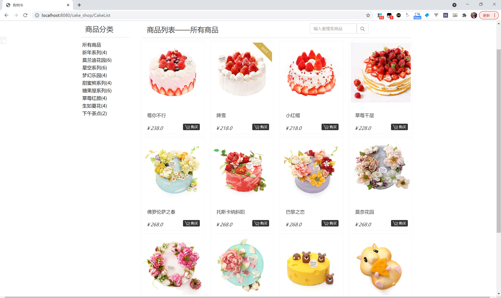
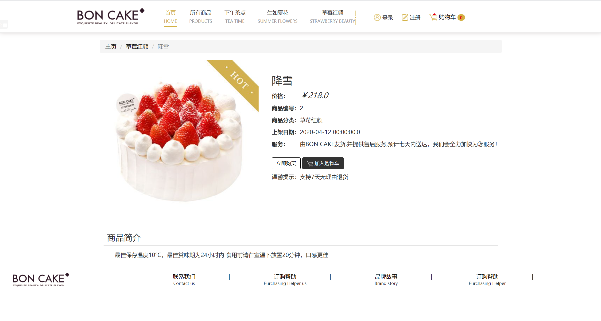
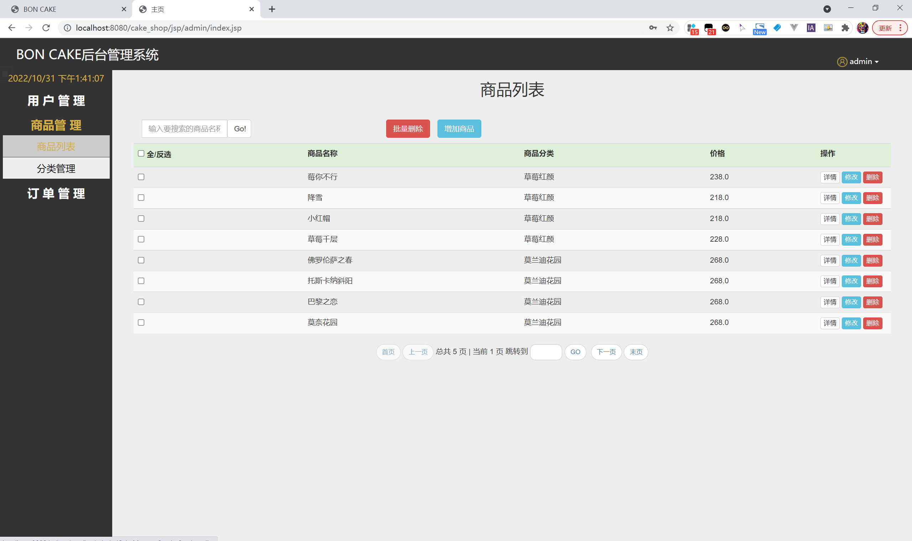
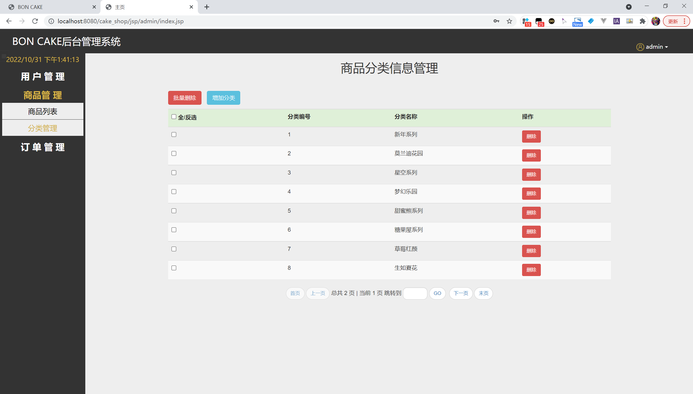
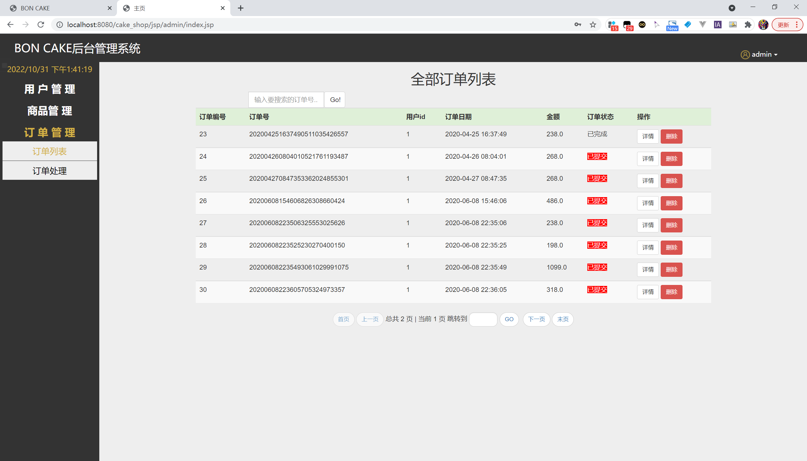
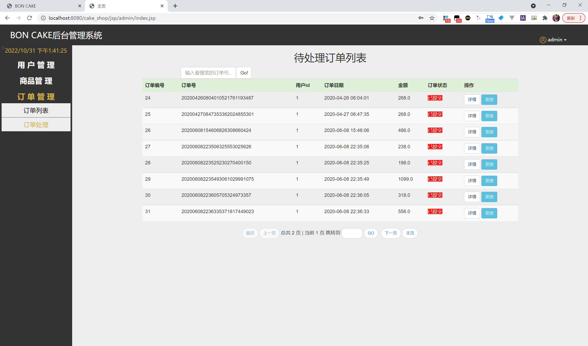

<h1 align="center">基于JSP+Servlet实现的java蛋糕甜品商店管理系统</h1>

 获取sql文件 QQ: 605739993 QQ群: 377586148 

 [源码获取网站: 从戎源码网](https://armycodes.com/)

## 简介

> 本代码来源于网络,仅供学习参考使用!
>
> 提供1.远程部署/2.修改代码/3.设计文档指导/4.框架代码讲解等服务
>
> 管理员登录地址：http://localhost:8080/photoalbum/admin/
>
> 管理员: admin 密码: admin
>
> 用户登录地址：http://localhost:8080/photoalbum/
> 
> 用户：zhangsan 密码: 123

## 项目介绍

基于JSP+Servlet实现的java蛋糕甜品商店管理系统，主要功能如下：

**【用户】**
登录；注册
商品购买，加入购物车，搜索商品，商品分类

**【管理员】**
用户管理；商品管理；
订单管理：订单列表，订单处理

## 环境

- <b>IntelliJ IDEA 2020.3</b>

- <b>Mysql 5.7.26</b>

- <b>Tomcat 8.0.32</b>

- <b>JDK 1.8</b>

## 运行截图

